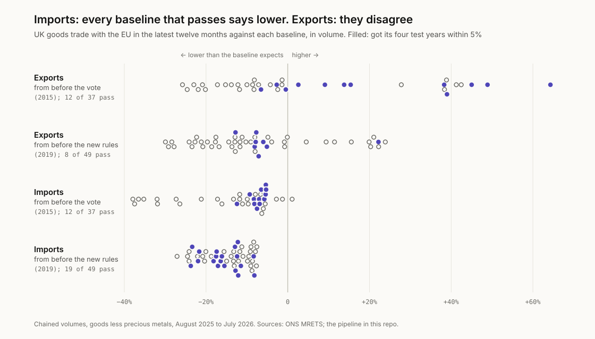
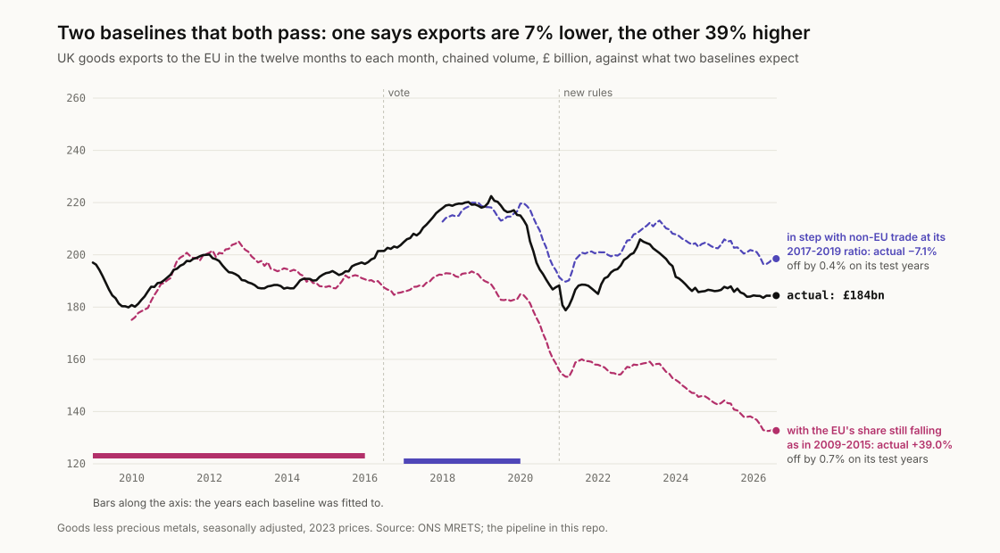
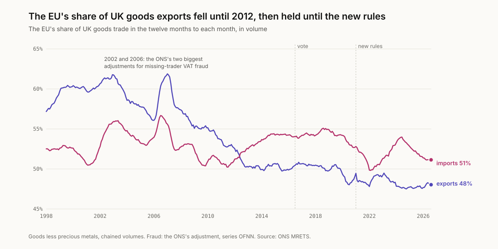
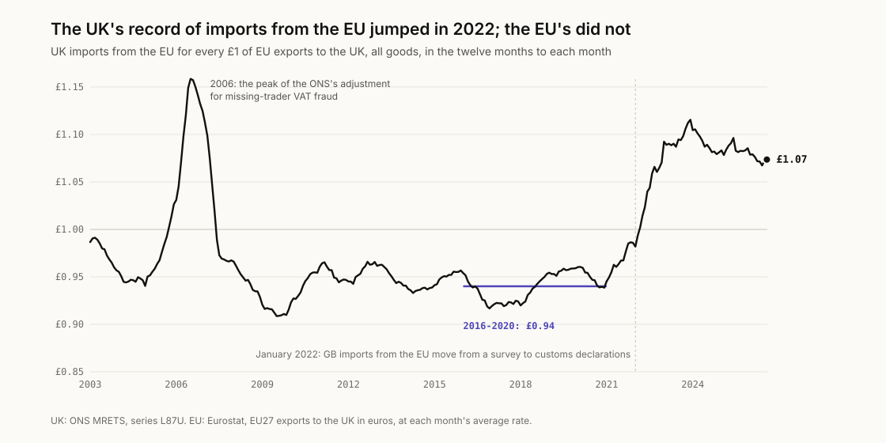

# brexit-baseline

How much UK goods trade with the EU is missing compared with where it would
otherwise have been, and how much the answer depends on what "otherwise"
means.

**Try the baselines yourself:** [finntech3.github.io/brexit-baseline](https://finntech3.github.io/brexit-baseline/)

## The finding

**Every baseline that passes a simple test says UK goods imports from the EU
are lower than they would otherwise have been: by between 5% and 24% in the
latest twelve months. For exports to the EU, the baselines that pass
disagree on the direction, from 13% lower to 64% higher.**

<picture>
  <source media="(prefers-color-scheme: dark)" srcset="docs/figures/recipes-dark.svg">
  
</picture>

Nobody can observe the UK that stayed in, so every estimate of what Brexit
did to trade compares what happened with a recipe for what would have
happened. I built 86 of those baselines for each direction of trade from the
ONS's own monthly figures: three recipes, two cut-offs and every start year
from 2001. Then I gave each one a test before believing it. Run four years
earlier, as if its cut-off had come four years sooner, could it forecast the
four ordinary years that followed to within 5%?

For imports, 31 of the 86 pass, and all 31 find trade with the EU lower. For
exports, 20 pass: 10 find exports lower, by up to 12.8%, and 10 find them
higher, by up to 64.3%. What divides them is one assumption. The ten that
find exports higher all carry a fall forward, in exports to the EU or in the
EU's share of UK exports, of between 0.5% and 4.7% a year. The ten that find
them lower carry forward almost no change: between a 0.3% fall and a 0.4%
rise a year.

<picture>
  <source media="(prefers-color-scheme: dark)" srcset="docs/figures/two-dark.svg">
  
</picture>

**What I think this means.** On imports the figures agree on the direction:
lower, by roughly a twentieth to a quarter. On exports they cannot
settle it alone, and anyone quoting a single figure for what Brexit did to
UK exports has made an assumption about the years before the vote, whether
they say so or not. My own reading leans to exports 5% to 8% lower, because
the EU's share of UK exports stopped falling in 2012 and held until the new
rules came in, through the years after the vote as well. But that is a
judgement about a world that did not happen, not a measurement.

## Why exports split: a share that stopped falling

<picture>
  <source media="(prefers-color-scheme: dark)" srcset="docs/figures/share-dark.svg">
  
</picture>

The EU took 60.4% of UK goods exports in 1999 and 50.2% in 2012, in volume.
From 2012 to 2019 it held between 49.4% and 50.7%; in the latest twelve
months it is 48.0%. A baseline fitted to the long fall carries it on, and
one fitted to the level stretch does not. The years before the vote cannot
say which is right, because the fall ended only four years before it.

Two years stand out, 2002 and 2006. They are the two biggest years of the
ONS's adjustment for missing-trader VAT fraud (£11.5 billion and £22.4
billion of imports at 2023 prices, series OFNN), and I have left them in. The
top of the export range, 64.3% higher, comes from a baseline fitted from 2006;
fitted from 2007, the same recipe says 45.0%.

## Whose record?

<picture>
  <source media="(prefers-color-scheme: dark)" srcset="docs/figures/records-dark.svg">
  
</picture>

For imports there is a second question: whose figures? The EU publishes its
own record of what it sends the UK, and until 2021 the two moved together.
For every £1 the EU recorded sending, the UK recorded between 92p and 97p
arriving, year by year from 2007 to 2020. In January 2022 the UK's record of
imports from the EU rose 14.2% on the month, while the EU's record of exports
to the UK fell 3.3%. That was the month Great Britain started counting
imports from the EU from customs declarations instead of a survey. The ONS
said at the time that its figures from January 2022 "are not directly
comparable with previous months", and that HMRC was "confident that the
strong rise in imports from the EU this month is predominantly the result of
genuine increases in trade". The EU's record shows no such rise, and the gap
has not closed: in the latest twelve months the UK recorded £1.07 for every
£1.

If the EU's record is the right one, UK imports from the EU are a further
12.4% lower than the UK's own figures show, and the baselines that pass put
them between 17% and 33% lower.

The same check cannot be made on exports. Since 2021 the EU has recorded
imports from outside the EU by country of origin, so goods sent from the UK
but made elsewhere stopped counting as coming from the UK.

## Verify before you interpret

Every baseline rests on the ONS's monthly series, so the first check is that
they add up the way the ONS says they do.

| Check | Result |
|---|---|
| Every published total rebuilt from its parts, in current prices, every month since January 1997: the ten commodity sections to each partner's total, EU and non-EU to the world, and all goods less precious metals | 3,550 of 3,550 exact to the published £1 million |
| The months add to the published quarters and years, for all eight series the study uses | 1,176 of 1,176 exact |
| Twin: the same sums in chained volumes, which are not additive | 190 of 2,130: fails |
| Every baseline, on made-up trade with a 10% fall from 2021 built in | each finds exactly that fall and passes its test exactly |

The twin's matches are not luck: 186 of the 190 are in the months from
January 2024 on, the only stretch where the chained parts still add up.

## The same question, other ways

| | From before the vote (2015) | From before the new rules (2019) |
|---|---|---|
| Exports: every baseline | 25.8% lower to 64.3% higher | 29.9% lower to 23.9% higher |
| Exports: those that pass | 12, from 6.5% lower to 64.3% higher | 8, from 12.8% lower to 22.2% higher |
| Exports: the closest test | 6.5% lower (own trend, 2008-2015) | 7.1% lower (with non-EU, 2017-2019) |
| Imports: every baseline | 37.9% lower to 1.1% higher | 27.1% to 7.6% lower |
| Imports: those that pass | 12, from 12.4% to 5.3% lower | 19, from 23.7% to 8.2% lower |
| Imports: the closest test | 9.3% lower (own trend, 2004-2015) | 11.5% lower (with non-EU, 2019) |
| Imports on the EU's record: those that pass | 23.3% to 17.1% lower | 33.2% to 19.6% lower |

The 5% pass mark is a choice. At 3%, imports are still lower on every
baseline that passes, by 5.7% to 22.0%, and exports from 2015 still split,
from 6.5% lower to 39.0% higher; exports from 2019 are then lower on all five
that pass, by 5.1% to 7.8%.

The latest twelve months are not a one-off. Against their 2017-2019 ratio
with non-EU trade, exports to the EU were between 2.6% and 8.4% lower in each
year from 2021 to 2025; against the 2019 ratio, imports were between 3.5% and
15.9% lower.

## How it works

- **The data.** The ONS's monthly trade in goods series (MRETS): UK trade with
  the EU and with everywhere else, exports and imports, seasonally adjusted,
  in chained volumes at 2023 prices, from January 1997 to July 2026. All of
  it is goods less precious metals: movements in non-monetary gold, in the
  ONS's words, "can be large and highly volatile, distorting underlying
  trends". For the second record, Eurostat's EU27 exports to the UK, in
  euros, turned into pounds at each month's average rate.
- **Three recipes.** *Own trend*: trade with the EU keeps growing at its own
  rate, a straight line through the logs of the monthly figures. *With
  non-EU*: it moves in step with the UK's trade with everywhere else, at the
  ratio between the two in the fit years. *With non-EU and drift*: the same,
  but that ratio keeps moving at the rate it had been moving.
- **Two cut-offs.** 2015, the last full year before the referendum, measures
  the vote and the new rules together. 2019, the last full year before the
  new rules and the pandemic, takes whatever happened after the vote as given
  and measures the new rules alone.
- **Start years.** Every year from 2001 to the cut-off, with at least five
  years for the recipes with a slope: 37 baselines from 2015 and 49 from
  2019.
- **The gap.** What was traded in the latest twelve months, August 2025 to
  July 2026, over what the baseline expects, minus one.
- **The test.** The same recipe with every year moved four earlier, judged on
  the four years after its cut-off: 2012 to 2015 for the 2015 baselines, 2016
  to 2019 for the 2019 ones. It passes if what happened was within 5% of what
  it expected.
- **The EU's record.** From January 2021, UK imports from the EU are moved in
  line with how far the two records have come apart since 2016 to 2020, when
  the UK recorded 94p arriving for every £1 the EU recorded sending.

More on each choice in [docs/DESIGN-DECISIONS.md](docs/DESIGN-DECISIONS.md).
Every source, address and checksum is in [docs/SOURCES.md](docs/SOURCES.md).

## What this leaves out

- **Services.** Goods only.
- **Other countries.** These baselines use only the UK's own trade. Studies
  that compare the UK with a group of similar countries can separate a shock
  to the UK from one to its trade with the EU better than this can; I have
  not built one.
- **Everything else that happened.** The pandemic, the energy shock and
  anything that hit trade with the rest of the world differently from trade
  with the EU all move these answers. A gap against a baseline is not proof
  of what caused it.
- **Revisions.** The ONS revises recent months, so the latest figures will
  move.
- **The number most often quoted.** The Office for Budget Responsibility
  assumes that "both exports and imports will be around 15 per cent lower in
  the long run than if the UK had remained in the EU". That is all UK trade,
  goods and services, with every country, relative to the size of the
  economy, in the long run. It is not the same measure as anything here, and
  I have not tried to test it.

## What I got wrong first

- **I nearly used the EU's volume index.** Eurostat publishes volumes for its
  exports to the UK, and on those, UK imports from the EU were 41.7% lower
  than in 2015 relative to imports from elsewhere. But that index had drifted
  70.3% against the ONS's own volumes between 2002 and 2019, before anything
  changed, because the two measure prices differently. The two records are
  now compared in pounds, where they moved together until 2021.
- **I started with a three-year trend.** Fitted to 2013 to 2015, it said
  exports to the EU were 27.5% lower. Its own test missed by 14.5%. The
  minimum is now five years, and every recipe is tested.
- **I assumed prices would cancel out.** Comparing trade with the EU against
  trade elsewhere in pounds, I expected price changes to hit both alike. They
  did not: against 2019, exports to the EU are 5.1% lower in volume but 1.8%
  higher in current prices. Everything is now in volumes.

## Running it

Python 3.11 or later, standard library only.

```sh
python -m pip install pytest
PYTHONPATH=pipeline/src python -m baseline.report    # every number above
python -m pytest pipeline/tests                      # the checks, the twin and the recipes
python scripts/make_figures.py                       # redraw docs/figures
PYTHONPATH=pipeline/src python -m baseline.build     # the app's data
```

The app, in `web/`, needs Node 22:

```sh
cd web
npm ci
npm test
npm run dev
```

## License

MIT for the code. ONS data are used under the Open Government Licence v3.0;
Eurostat's data are reused under its copyright notice, which allows reuse
with acknowledgement of the source.
